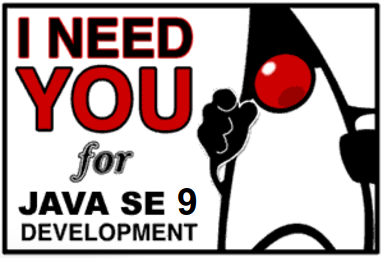

# jdk9-jigsaw

Examples of some of the features of Jigsaw released in the Early Access build of JDK9.

Many of the examples here are directly from the Project Jigsaw: Module System Quick-Start Guide, see [http://openjdk.java.net/projects/jigsaw/quick-start](http://openjdk.java.net/projects/jigsaw/quick-start) but we have also contributions from the Java community.

___

####   Please note you are in the `exercise-solutions` branch which contains solved exercises and is mainly for beginners or if you have hit a roadblock while solving the exercises in the `master` branch. 

####   Looking at the solutions can take away the fun and challenge behind solving the exercises. Switch to the `master` branch in case you would like to continue to have fun by solving the exercises and working through the challenges.

___

## Setup (all platforms)

See [Download, install and verify JDK](setupAndVerifyJDK.md).
         
#### Download and install `git` or `git-bash`

- Ensure you have a `git` client installed on your local machine/VM/vagrant box, for Windows users `git-bash` is recommended 

#### Download and install the `tree` and `wget` command

See [Download and install tree and wget](setupTreeAndWget.md).

#### Vagrant box

- Alternatively a Vagrant box is available at https://github.com/ali-ince/LJC_April2017_Hackday, please make use of this facility (thanks @ali-ince).

#### (Optional) Install JDK 9 compliant IDE

- Install the latest IDE (IntelliJ, Eclipse, NetBeans - paid or community version) that supports JDK 9 EA, once installed configure the IDE to pickup the JDK 9 EA installed in the previous steps.

#### Other preparations

- Get familiar with the command-line a bit as we will be using much of it during the weekend

- Prepare your VMs or cloud instances with the above, in case your local machine is not up for any installation or configurations 

**Note:** the bash files provided should work on Linux and in theory on the MacOS as well.

For Windows users, if you use `git-bash` (recommended) or `cgywin` they should work for you. 

In the worst case scenario, we would have to manually convert the `.sh` files into `.bat`, with minor tweaks should also work there. Happy to received a pull request for it.

## Exercises / examples covered

- Session 1: Jigsaw Introduction
   - Greetings [./session-1-jigsaw-intro/01_Greetings](./session-1-jigsaw-intro/01_Greetings)
   - Greetings world [./session-1-jigsaw-intro/02_GreetingsWorld](./session-1-jigsaw-intro/02_GreetingsWorld)
   - Multi-module compilation [./session-1-jigsaw-intro/03_MultiModuleCompilation](./session-1-jigsaw-intro/03_MultiModuleCompilation)
   - Packaging [./session-1-jigsaw-intro/04_Packaging](./session-1-jigsaw-intro/04_Packaging)
   - Missing requires [./session-1-jigsaw-intro/05_Missing_requires](./session-1-jigsaw-intro/05_Missing_requires)
   - Missing exports [./session-1-jigsaw-intro/05_Missing_exports](./session-1-jigsaw-intro/05_Missing_exports)
   - Services [./session-1-jigsaw-intro/06_Services](./session-1-jigsaw-intro/06_Services)
   - javac --patch-module option [./session-1-jigsaw-intro/07_patch_module_option](session-1-jigsaw-intro/07_patch_module_option)
   - Modules export conflict [./session-1-jigsaw-intro/08_ModulesExportConflict](session-1-jigsaw-intro/08_ModulesExportConflict)
   - Automatic modules [./session-1-jigsaw-intro/09_Automodules](session-1-jigsaw-intro/09_Automodules)

- Session 2: JLink
   - JLink example [./session-2-jlink/01_JLink](session-2-jlink/01_JLink)
   - JMod example [./session-2-jlink/02_JMod](session-2-jlink/02_JMod) 

- Session 3: JShell
   - JShell quick tutorial [./session-3-jshell/](./session-3-jshell/)
   - JShell examples [./session-3-jshell/JShell-Examples](./session-3-jshell/JShell-Examples)
   - shellFX [./session-3-jshell/shellFX/](./session-3-jshell/shellFX/)
   - teamshell [./session-3-jshell/teamshell/](./session-3-jshell/teamshell/)
   
- Session 3: Refactoring/migration sessions
   - Junit 5 migration to Java 9 modules [./session-3-refactoring-migration/01_junit5_to_java_9](session-3-refactoring-migration/01_junit5_to_java_9)
   - Building Java 9 Modules using Gradle (from monolith to modular) [./session-3-refactoring-migration/02_monolith_to_modular_using_gradle](session-3-refactoring-migration/02_monolith_to_modular_using_gradle)
   - ServiceMonitor - Migration from Java 8 to Java 9 [./session-3-refactoring-migration/03_ServiceMonitor_migration_to_java_9](session-3-refactoring-migration/03_ServiceMonitor_migration_to_java_9)
   - ServiceMonitor - Modularisation to Java 9 Modules (Maven project) [./session-3-refactoring-migration/04_ServiceMonitor_modularisation_to_java_9](session-3-refactoring-migration/04_ServiceMonitor_modularisation_to_java_9)
        
Each example is enclosed in a folder of its own containing bash scripts to compile, package and run the respective examples. Use these scripts for each of the examples.

## Resources

### Must reads
- [The State of the Module System](http://openjdk.java.net/projects/jigsaw/spec/sotms/)
- [JEP 261](http://openjdk.java.net/jeps/261)
- [http://mail.openjdk.java.net/pipermail/adoption-discuss/2015-September/001053.html](http://mail.openjdk.java.net/pipermail/adoption-discuss/2015-September/001053.html)  
- [http://mail.openjdk.java.net/pipermail/adoption-discuss/2015-September/001056.html](http://mail.openjdk.java.net/pipermail/adoption-discuss/2015-September/001056.html)

### Other resources
- [JDK 9 / Jigsaw Resources](./Java-9-Resources.md)
- [Adopt OpenJDK homepage](https://adoptopenjdk.java.net/)
- [Adopt OpenJDK: Getting Started Kit](http://bit.ly/1NUkPWw)

---

